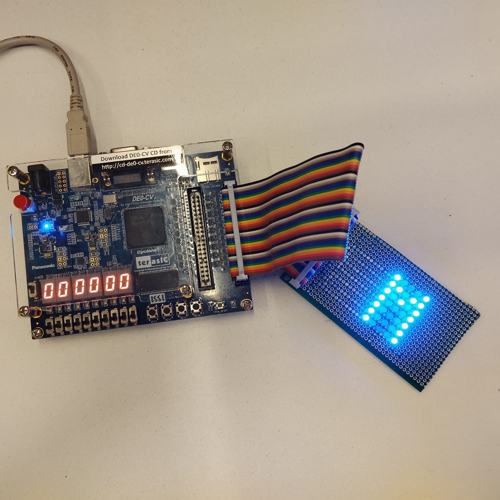

# Módulo Matriz de LEDs 7x5 — GPIO-Terasic compatível



## Visão Geral

Este projeto consiste em uma matriz de LEDs 7x5 desenvolvida com o objetivo de auxiliar nas aulas da disciplina de Design de Computadores. A matriz pode ser controlada por meio de seu barramento de 40 pinos (compatível com GPIO-Terasic), utilizando VHDL para implementar o controle dos LEDs. O sistema é capaz de exibir caracteres ou símbolos personalizados.

## Objetivos

- Desenvolver um periférico simples (matriz 7x5) para prática com sistemas digitais;
- Permitir controle como um periférico de um processador, via barramento de dados/memória;
- Exercitar a integração entre hardware físico e componentes externos aos kits padrão da Terasic;
- Auxiliar na didática dos alunos na compreensão do funcionamento e definição de mapeamento de memória na eletrônica digital;
- Representar símbolos ou letras utilizando uma interface visual.

## Materiais Utilizados

- 35 × LEDs azuis  
- Fios wire-up  
- 1 × Placa padrão dupla face  
- 1 × Flat cable de 40 vias  
- 2 × Conectores latch de 40 vias fêmea  
- 1 × Conector latch de 40 vias macho  

## Funcionamento

Cada LED está ligado a um GPIO específico do barramento padrão GPIO-Terasic. O LED superior esquerdo está conectado ao GPIO[0], e o LED inferior direito ao GPIO[34]. A placa permite que os LEDs da matriz 7x5 sejam acionados diretamente, bastando aplicar nível lógico 1 (3,3V) ao respectivo pino. A lógica de controle deve ser implementada em VHDL, podendo receber valores codificados como caracteres ou bitmaps a serem exibidos.

## Diagrama de Conexão

- As linhas e colunas da matriz são conectadas aos pinos GPIO da placa do kit de desenvolvimento por meio de um flat cable.  
- A ativação dos LEDs é feita de forma coordenada entre colunas e linhas.  
- A alimentação e o controle de corrente são providos pela placa FPGA, com resistores apropriados.  

## Exemplo de Código(VHDL)

O código de exemplo abaixo está instanciando uma entidade chamada matriz_LED_Linhas [matriz_LED_Linhas.vhd]() e conectando suas saídas a um vetor de sinais chamado GPIO_1(barramentos de GPIO do kit terasic).

```vhdl
MATRIZset : entity work.matriz_LED_Linhas
			port map(
			ADDRESS	=> sinalLocal, -- @256 - seleciona qual linha você deseja, através do valor em DADO (0 a 6) / @255 - quais leds você deseja acionar, através do valor em DADO (0 a 6)
			DADO    => sinalLocal, -- quando o endereço for @256, o valor em dado representa qual linha será acionada, quando o valor for @255 representa qual o valor a ser "escrito" nessa linha
			Lin0 		=> Lin0_GPIO,  -- vetor que representa as linha 0
			Lin1 		=> Lin1_GPIO,  -- vetor que representa as linha 1
			Lin2 		=> Lin2_GPIO,  -- vetor que representa as linha 2
			Lin3 		=> Lin3_GPIO,  -- vetor que representa as linha 3
			Lin4		=> Lin4_GPIO,  -- vetor que representa as linha 4
			Lin5 		=> Lin5_GPIO,  -- vetor que representa as linha 5
			Lin6 		=> Lin6_GPIO,  -- vetor que representa as linha 6	
			CLK		=> CLK          			
			);			
			
-- Lin0_GPIO
GPIO_1(0)  <= Lin0_GPIO(4);
GPIO_1(7)  <= Lin0_GPIO(3);
GPIO_1(14) <= Lin0_GPIO(2);
GPIO_1(21) <= Lin0_GPIO(1);
GPIO_1(28) <= Lin0_GPIO(0);

-- Lin1_GPIO
GPIO_1(1)  <= Lin1_GPIO(4);
GPIO_1(8)  <= Lin1_GPIO(3);
GPIO_1(15) <= Lin1_GPIO(2);
GPIO_1(22) <= Lin1_GPIO(1);
GPIO_1(29) <= Lin1_GPIO(0);

-- Lin2_GPIO
GPIO_1(2)  <= Lin2_GPIO(4);
GPIO_1(9)  <= Lin2_GPIO(3);
GPIO_1(16) <= Lin2_GPIO(2);
GPIO_1(23) <= Lin2_GPIO(1);
GPIO_1(30) <= Lin2_GPIO(0);

-- Lin3_GPIO
GPIO_1(3)  <= Lin3_GPIO(4);
GPIO_1(10) <= Lin3_GPIO(3);
GPIO_1(17) <= Lin3_GPIO(2);
GPIO_1(24) <= Lin3_GPIO(1);
GPIO_1(31) <= Lin3_GPIO(0);

-- Lin4_GPIO
GPIO_1(4)  <= Lin4_GPIO(4);
GPIO_1(11) <= Lin4_GPIO(3);
GPIO_1(18) <= Lin4_GPIO(2);
GPIO_1(25) <= Lin4_GPIO(1);
GPIO_1(32) <= Lin4_GPIO(0);

-- Lin5_GPIO
GPIO_1(5)  <= Lin5_GPIO(4);
GPIO_1(12) <= Lin5_GPIO(3);
GPIO_1(19) <= Lin5_GPIO(2);
GPIO_1(26) <= Lin5_GPIO(1);
GPIO_1(33) <= Lin5_GPIO(0);

-- Lin6_GPIO
GPIO_1(6)  <= Lin6_GPIO(4);
GPIO_1(13) <= Lin6_GPIO(3);
GPIO_1(20) <= Lin6_GPIO(2);
GPIO_1(27) <= Lin6_GPIO(1);
GPIO_1(34) <= Lin6_GPIO(0);
```


## Mapeamento dos GPIOs

A matriz 7x5 utiliza 35 GPIOs sequenciais do conector GPIO da DE0-CV. A disposição física dos LEDs na matriz segue a organização abaixo (visão frontal):

```
Linha 0 (topo)     -> GPIO_1(0) GPIO_1(7)  GPIO_1(14) GPIO_1(21) GPIO_1(28)
Linha 1            -> GPIO_1(1) GPIO_1(8)  GPIO_1(15) GPIO_1(22) GPIO_1(29) 
Linha 2            -> GPIO_1(2) GPIO_1(9)  GPIO_1(16) GPIO_1(23) GPIO_1(30)
Linha 3            -> GPIO_1(3) GPIO_1(10) GPIO_1(17) GPIO_1(24) GPIO_1(31) 
Linha 4            -> GPIO_1(4) GPIO_1(11) GPIO_1(18) GPIO_1(25) GPIO_1(32)
Linha 5            -> GPIO_1(5) GPIO_1(12) GPIO_1(19) GPIO_1(26) GPIO_1(33)
Linha 6 (base)     -> GPIO_1(6) GPIO_1(13) GPIO_1(20) GPIO_1(27) GPIO_1(34) 
```

Cada LED está diretamente ligado a um pino específico, sem multiplexação. O controle é feito diretamente via sinais lógicos de 3,3V aplicados ao pino correspondente.

## Exemplo de Bitmap de Caractere

Para representar a letra **M**, por exemplo, podemos usar um vetor de 7 linhas, onde cada elemento é um vetor de 5 bits (colunas), sendo `1` para LED aceso e `0` para LED apagado:

```vhdl
type caractere_t is array (0 to 6) of std_logic_vector(4 downto 0);

constant M : caractere_t := (
  "10001",  -- linha 0 (topo)
  "11011",  -- linha 1
  "10101",  -- linha 2
  "10001",  -- linha 3
  "10001",  -- linha 4
  "10001",  -- linha 5
  "10001"   -- linha 6 (base)
);
```

Você pode construir outros caracteres com a mesma lógica e utilizar um processo em VHDL que percorra esse vetor, acionando as saídas GPIO correspondentes em cada linha e coluna.
